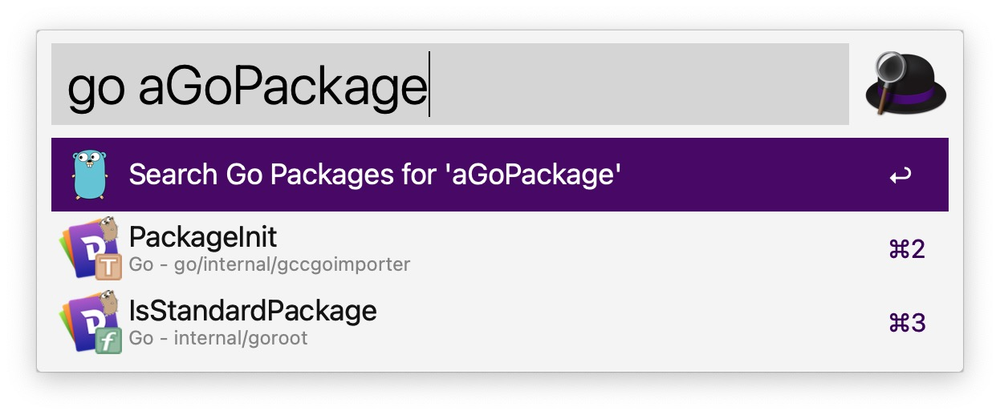

# Hi Go - Day1

> 60mins.

1. [Installing Go](https://go.dev/doc/install)
2. Install [VSCode](https://code.visualstudio.com/) and extension Go
  
3. Read below docs and coding:
     - [Tutorial: Getting started](https://go.dev/doc/tutorial/getting-started.html)
   - [Tutorial: Create a module](https://go.dev/doc/tutorial/create-module.html)
4. More <https://go.dev/doc/> and coding.

## Tips

- `go help`,  `go help [some cmd]` for details.
- `go version`: Check Go version(Verify that you've installed Go successfully).
- `go mod`
  - `go mod init`: Init initializes and writes a new go.mod file in the current directory, in
  effect creating a new module rooted at the current directory. The go.mod file
  must not already exist.
  - `go mod tidy`: Tidy makes sure go.mod matches the source code in the module.
  It adds any missing modules necessary to build the current module's
  packages and dependencies, and it removes unused modules that
  don't provide any relevant packages. It also adds any missing entries
  to go.sum and removes any unnecessary ones.
- compile & install
  - `go build` : compile the code into an executable.
  - `go list -f '{{.Target}}'` : discover the install path  

- Use and search extras packages: <https://pkg.go.dev/>

  - if you're in China, set Go module proxy:

    ```
    go env -w GO111MODULE=on
    go env -w GOPROXY=<https://goproxy.cn,direct>
    ```

  - set alfred workflow of "Web Search" on Mac
    

## Next

TODO...
